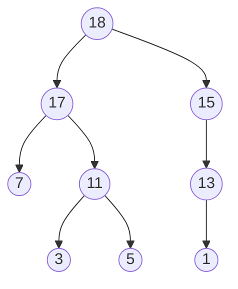
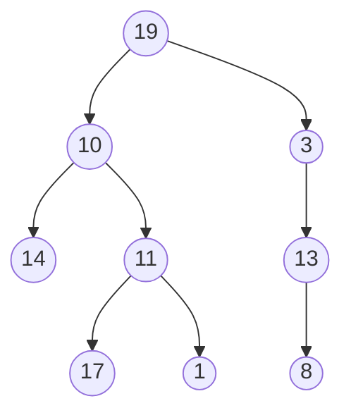

# 树：非线性数据结构

树结构(tree structure)，节点数据集  
通常不允许对一个节点引用多次，且这些引用不能指向根节点  
根据节点存储的值，分类为：有序树和无序树  
根据树的用途，分类为：存储值类型的数据，和存储对象的实例  

很多数据结构，都是以树结构为基础构建的  

## 树结构与树类型

tree structure和tree data type  

树类型，必须存在一个值，且其中每个子树也是树类型  
树结构，由一组节点构成，按照树类型的模式互连起来  

有序树：  


无序树：  


其中，每个节点都是一棵树，且其潜在子节点均为树  

## 树的术语

|术语|解释|
|:--|:--|
|节点`node`|树中存储的任何一个值或对象，均被描述为一个节点。根及所有子树和子孙均为互相独立的节点|
|根`root`|数得基础节点。通常画在示意图的顶端。即便根节点没有任何子孙，仍为一棵完整的树|
|父节点`parent`|任何一个含有1到n个子节点的节点。每个子结点，有且仅有一个父节点。每个父节点可以用0到n个子节点|
|子节点`child`|若一棵树，不是其他结构的子树，则其根节点是唯一一个不是子结点的节点|
|兄弟节点`siblings`|具有同一父节点的所有子结点互称兄弟节点|
|叶节点`leaf`|任何没有子结点的节点|
|边`edge`|父节点和子结点之间的路径或引用|
|子孙`descendant`|以某节点为根，则以次节点确定的子树上的任意节点都是该节点的子孙|
|祖先`ancestor`|由根节点到某节点的所有边上的节点，都是该节点的祖先|
|路径`path`|由一个节点到其某子孙节点的一系列边，构成该节点到这个子孙节点的路径|
|高度`height of tree`|根节点到最远叶节点之间的边的个数|
|深度`depth`|根节点到某节点之间的边的个数。根节点深度为0|

## 树的基本操作

任何不存在父节点或子结点的单一节点，也可视为一棵完整的树，故与树结构相关的大部分基本操作，都可以从一个单一节点的角度定义  

|操作|解释|
|:--|:--|
|`data`获取节点数据|与单一节点相关，返回当前节点存储的对象或数据|
|`children`获取子节点|返回当前字节点的所有子结点|
|`parent`获取父节点|为某些树结构提供`爬树`机制，即由任意一个节点反向遍历至根节点|
|`enumerate`枚举|返回当前特定节点在内的所有该节点的子孙|
|`insert`插入|将一个新节点，作为已有节点的字节点添加进树中。如果树结构对某一父节点拥有的子结点总量进行了限制，并且添加的节点超出了限制，则会将其中一个已存在的字节点位置重定位，作为新插入节点的子节点|
|`graft`嫁接|与插入类似，但插入的新节点原本就拥有自己的子孙节点，即插入一个子树。如果树结构对某一父节点拥有的子结点总量进行了限制，并且添加的节点超出了限制，则会将其中一个已存在的字节点位置重定位，作为新插入节点的子节点|
|`delete`删除|删除树中的特定节点。被删除的节点的子孙节点应以某种方式，重定位到被删节点的父节点。|
|`prune`修剪|删除树中的特定节点，及特定节点的子孙节点|

## 树的实例化

常用的编程语言，都没有对树结构提供一种简便通用的具体实现  

## 树结构

以二叉树举例：创建一棵不允许加入重复值的有序树，且每个节点最多拥有两个子结点  

参考类TreeTest.Node()  

## 递归

递归recursive，某函数为了重复执行某项操作，而对其自身进行调用的过程  
使用递归，必须设置基准条件(base case)，是函数正常返回，而避免进入死循环(infinite loop)  

斐波那契数列Fibonacci sequence：  
```csharp
    private static int FibonacciSequence(int n) 
    {
        if (n < 1) return 0;
        if(n == 1) return 1;
        return FibonacciSequence(n - 1) + FibonacciSequence(n - 2);
    }
```

递归好用，但不要乱用；能不使用就尽量避免使用  
效率并不比传统写法高效，甚至更低  

## 遍历

遍历树walking the tree  

深度优先遍历depth-first search，通过递归对每个节点访问：  
- 中序遍历in-order traversal，访问顺序为：左侧子节点，然后当前节点，最后右侧子结点  
- 前序遍历pre-order traversal，访问顺序为：当前节点，然后根据特定次序，依次访问子结点  
- 后序遍历post-order traversal，访问顺序为：以特定次序，依次访问子结点，然后访问节点本身  

广度优先遍历breadth-first search  
