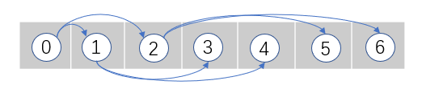
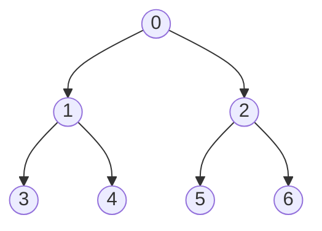

# 堆：有序树

堆Heap，特殊的树结构；有序树  

最小堆：堆为升序，根节点的值或优先级小于它的子结点  
最大堆：堆为降序，根节点的值或优先级大于它的子结点  

此处的堆Heap，应与计算机科学领域的堆内存概念区分，堆内存指系统动态分配的内存  

## 堆的实现

堆结构与树结构类似，使用链表、链接节点或数组，对堆进行实现  

二叉堆binary heap，除了最深的一层，其余每层都被节点占满。  
在最深的一层，节点从左到右排列，直到占满整层。

基于数组的二叉堆实现：
  

上图中的二叉堆，每个父节点都有两个分别位于2i+1和2i+2的子结点，i为这个父节点序号，数据集第一个节点序号从0开始  

有时候为了简化查找给定序号的父节点和子结点的过程，会跳过数组中的序号0的位置；此时，位置i节点的子结点，其子结点序号为2i和2i+1  

## 堆的操作

|操作|解释|
|:--|:--|
|插入`insert`|向堆中插入新节点。必须对堆重排序，保证新加节点不会打乱堆的原有顺序。操作复杂度O(log(n))|
|查找最大值`findMax`|用于最大堆，返回数据集中具有最大值或最高优先级的对象。数组堆中的该对象，常位于序号0或1的位置。该操作与栈或队列中的查看操作等效，它在使用堆实现一个优先级队列时尤为重要。操作复杂度为O(1)|
|查找最小值`findMin`|用于最小堆，返回数据集中具有最小值或最低优先级的对象。数组堆中的该对象，常位于序号0或1的位置。操作复杂度为O(1)|
|提取最大值`extractMax`|用于最大堆，返回数据集中具有最大值或最高优先级的对象，并从数据集中删除该对象。数组堆中的该对象，常位于序号0或1的位置。该操作与栈或队列中的弹出操作等效；与查找最大值操作一样。操作还会重排堆，保证堆序性。操作复杂度为O(log(n))|
|提取最小值`extractMin`|用于最小堆，返回数据集中具有最小值或最低优先级的对象，并从数据集中删除该对象。数组堆中的该对象，常位于序号0或1的位置。该操作与栈或队列中的弹出操作等效；与查找最小值操作一样。操作还会重排堆，保证堆序性。操作复杂度为O(log(n))|
|删除最大值`deleteMax`|用于最大堆，删除数据集中具有最大值或最高优先级的对象。数组堆中的该对象，常位于序号0或1的位置。操作还会重排堆，保证堆序性。操作复杂度为O(log(n))|
|删除最小值`deleteMin`|用于最小堆，删除数据集中具有最小值或最低优先级的对象。数组堆中的该对象，常位于序号0或1的位置。操作还会重排堆，保证堆序性。操作复杂度为O(log(n))|
|计数`count`|返回堆中所有节点的数量。操作复杂度为O(1)|
|查找子结点`children`|返回当前节点的两个子结点。由于进行了两次运算得到两个子结点，操作复杂度为O(2)|
|查找父节点`parent`|返回任意一个给定节点的父节点。操作复杂度为O(1)|

> 二叉堆和二叉查找树相似，也有不同。  
> 堆会根据节点的任意属性或时整个环境对节点的优先级进行排序，而每个节点的值却不必是有序的。  
> 对于二叉查找树，节点本身的值，就应该是有序的。  

## 堆的实例化

堆，也是某种形式的树结构，编程语言一般都没有原生的定义和实现  

## 最小堆结构

最大堆结构的实现，和最小堆的实现几乎一样  

此处使用数组构建的最小堆，第一个节点的序号为0；该序号会影响计算给定节点的父节点和子结点的公式  

参考类HeapTest.MinHeap()  
参考类HeapTest.MaxHeap()  

> 序号i处的节点，其子结点公式为2i+1和2i+2  
> 反推子结点i的父节点公式为(i-1)/2  
> 如果结果出现小数，只保留整数，保证堆结构的二叉性  

## 常见应用场景

选择算法selection algorithm：从数据集中选出第k个最大或最小的元素，或数据集中具有中位数的对象。典型的数据集中，该操作的复杂度为O(n)。然而，在已排序的堆的数组实现中，操作复杂度为O(1)，因为对于基于数组的堆而言，只需找到数组中的第k个元素即可  

优先级队列priority queue：一种抽象数据结构，除了其中的节点含有描述优先级的额外数值外，其结构与标准的队列非常相似。由于堆数据结构天生具有排序特性，因此常用于实现优先级队列  
