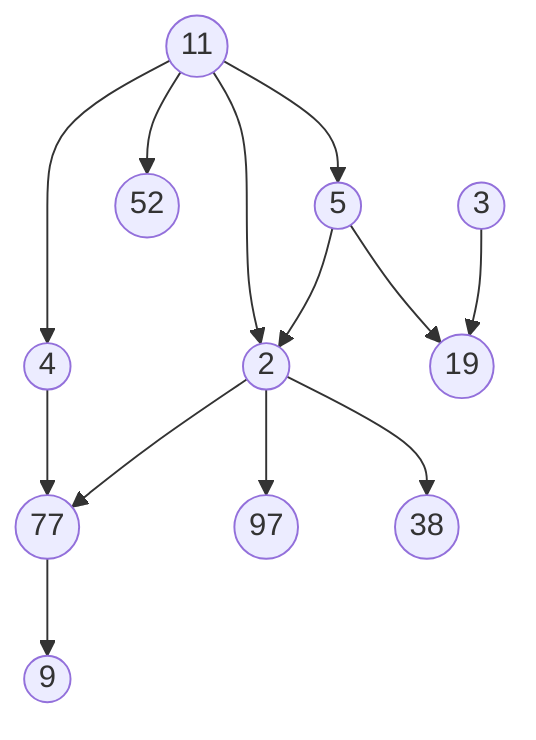
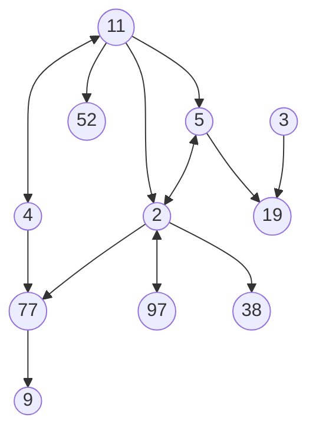
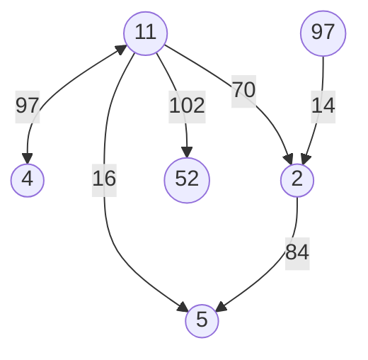

# 图：互相连接的对象

图Graph，一组不具备特定结构性关系的对象，每个对象都可拥有指向一个或多个其他对象的连接  

图中的对象称为节点、顶点或点  
对象之间的连接称为边、线或弧；这些连接可以是建议的引用，也可以是含有值的对象  

图为一对集合(N, E)；N是数据集中的节点集合，E是数据集中边的集合  

图的典型应用：社交媒体数据库中的个人之间的可视化关系  

## 概念图示

单向边的图示：  
> N={2,3,4,5,9,11,19,38,52,77,97}  
> E={2:38,2:77,2:97,3:19,4:77,5:2,5:19,11:2,11:4,11:5,11:52,77:9}  

双向边的图示：  
> N={2,3,4,5,9,11,19,38,52,77,97}  
> E={2:5,2:38,2:77,2:97,3:19,4:11,4:77,5:2,5:19,11:2,11:4,11:5,11:52,77:9,97:2}  

边上有特定值的图示：  
> N={2,4,5,11,52,97}  
> E={2:5(84),4:11(97),11:2(70),11:4(97),11:5(16),11:52(102),97:2(14)}  

## 图的操作

图的程序定义：三个基本对象类：节点，图数据集本身，以及边(可能含有数值或对象)  

|操作|解释|
|:--|:--|
|添加节点`AddNode`|又叫添加顶点`AddVertex`或添加点`AddPoint`。该操作只是单纯的添加新节点到图中，而不会添加对应的边或引用。操作复杂度O(1)|
|删除节点`DeleteNode`|又叫删除顶点`DeleteVertex`或删除点`DeletePoint`。从图中删除特定节点，并删除与相邻节点的边或引用。操作复杂度O(n+k)，n为图中节点总数，k为图中边的总数。图中的边通常为对象之间的指针，若将对象置为null，可删除对象上的所有边，操作复杂度将为O(1)|
|添加边`AddEdge`|又叫添加弧`AddArc`或添加线`AddLine`。为两个点添加有指向的边。该操作在图上和节点上都有实现，但参数不同。节点层面，被指向的点作为传入参数；图层面，两个节点都作为入参。如果需要，还要添加边的权值对象作为入参。图本身支持双向边，故不需要判断边的指向，操作复杂度O(1)|
|删除边`RemoveEdge`|又叫删除弧`RemoveArc`或删除线`RemoveLine`。判断是否存在特定指向的边，并删除之。该操作在图上和节点上都有实现，但参数不同。节点层面，被指向的点作为传入参数；图层面，两个节点都作为入参。如果需要，还要添加边的权值对象作为入参。图本身支持双向边，故不需要判断边的指向，操作复杂度O(1)|
|获取节点值`GetNodeValue`|又叫获取顶点值`GetVertexValue`或获取点值`GetPointValue`。返回当前节点所含的值，无论该值为值类型还是对象，操作复杂度(1)。该操作在图上和节点上都有实现，但图层面，需要把当前节点作为参数传入。|
|设置节点值`SetNodeValue`|又叫设置顶点值`SetVertexValue`或设置点值`SetPointValue`。为当前节点赋值，操作复杂度(1)。该操作在图上和节点上都有实现，但图层面，需要把当前节点作为参数传入。|
|是否相邻`Adjacent`|判断似乎否存在特定指向的边，并返回一个布尔值。需要定义在图上，参数为参与判断的两个节点。|
|获取相邻节点`Neighbors`|与树中获取子结点操作类似。返回一组由特定节点出发的边，指向的节点所构成的列表。需要定义在图上，参数为当前节点，操作复杂度O(1)|
|计数`Count`|返回图中节点总数。实现方式不同，操作代价也不同，通常操作复杂度O(1)|
|获取边权值`GetEdgeValue`|又叫获取弧权值`GetArcValue`或获取线权值`GetLineValue`。如果图支持含有权值的边，操作返回当前边的权值(值类型或对象类型)，操作复杂度O(1)。该操作可定义为节点对象的一部分，对应的边作为入参。|
|设置边权值`SetEdgeValue`|又叫设置弧权值`SetArcValue`或设置线权值`SetLineValue`。如果图支持含有权值的边，操作为当前边设置权值(值类型或对象类型)，操作复杂度O(1)。该操作可定义为节点对象的一部分，对应的边作为入参。|

## 图的实现

同堆一样，图也是某种形式的树结构，常用开发语言并未提供原生的支持和实现。  

## 图数据结构

参考类GraphTest.GraphNode()  
参考类GraphTest.Graph()  
